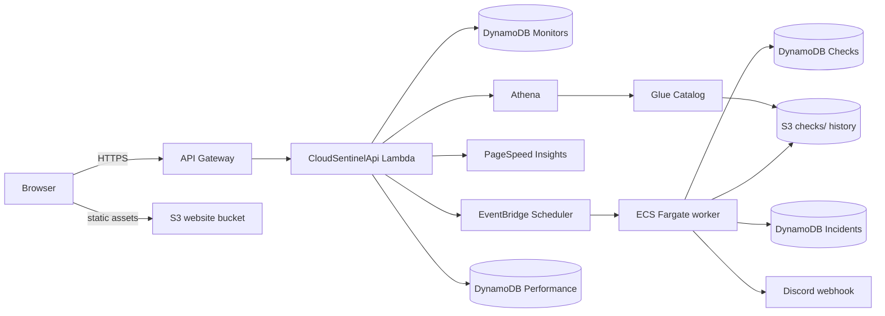
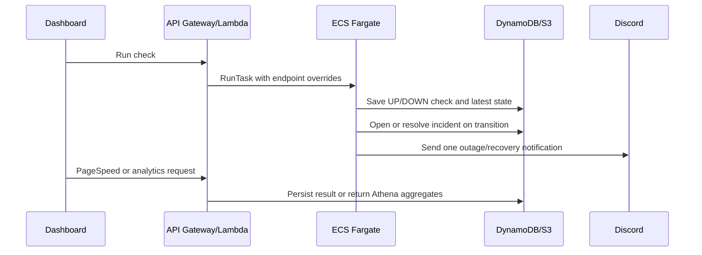

# CloudSentinel architecture

## Minimum viable product

The assessed MVP supports five user journeys:

1. Register, update, enable/disable, and delete a monitored HTTP endpoint.
2. Run an immediate availability check and view the result.
3. Configure recurring checks that run without manual AWS Console or CLI actions.
4. Detect outages/recoveries and send a webhook notification.
5. View historical uptime, incidents, latency, and PageSpeed performance.

Authentication, multi-team permissions, SMS/email channels, geographic probes, and public status pages are deferred until the assessed workflows are reliable.

## Planned deployed flows

### Assessment flow diagram



### State-transition evidence



### Interactive application

```text
Browser
  -> CloudFront when Learner Lab permits it, otherwise S3 website endpoint
  -> S3 frontend assets
  -> API Gateway
  -> Lambda API functions
  -> DynamoDB
```

### Immediate and scheduled monitoring

```text
Dashboard "Run now" -> API Gateway -> Lambda -> ECS RunTask
EventBridge Scheduler ---------------------------> ECS RunTask
ECS Fargate worker -> monitored website/API
                   -> DynamoDB latest state and result
                   -> S3 historical result
                   -> notification webhook on state transition
```

### Historical analytics

```text
S3 partitioned results -> Glue Data Catalog -> Athena
Dashboard -> API Gateway -> Lambda -> Athena -> dashboard charts
```

### PageSpeed

```text
Dashboard -> API Gateway -> Lambda -> PageSpeed Insights API
                                    -> DynamoDB/S3 persisted result
```

## Service responsibilities

| Service | Responsibility | Automated invocation evidence |
|---|---|---|
| S3 | Frontend assets and partitioned historical result files | Frontend deployment and monitoring-worker writes |
| CloudFront | Securely deliver the React application when permitted by the Learner Lab | Browser requests use the CloudFront URL; otherwise the S3 website URL is used |
| API Gateway | Expose monitor, check, incident, performance, and analytics APIs | React operations send HTTPS requests |
| Lambda | Validate requests, manage records/schedules/tasks, and invoke analytics/external APIs | API Gateway invokes functions |
| DynamoDB | Store monitor configuration, latest state, results, incidents, and PageSpeed records | Lambda and ECS worker read/write data |
| ECR | Store the monitoring-worker image | Deployment publishes the versioned image |
| ECS Fargate | Execute isolated availability checks | Lambda and EventBridge Scheduler start tasks |
| EventBridge Scheduler | Run recurring monitor tasks | Schedules are created/updated by application code |
| Glue | Describe the historical S3 dataset | Deployment/crawler updates the catalog |
| Athena | Calculate historical uptime and latency analytics | Lambda starts queries for the dashboard |
| PageSpeed Insights | External performance audit | A dashboard operation invokes the API |
| Notification webhook | External outage/recovery alert | The worker invokes it on incident transitions |

EventBridge Scheduler and ECR are important supporting services but should not be assumed to earn marks outside the categories listed in the assignment rubric.

## Domain model

### Monitor

| Field | Type | Purpose |
|---|---|---|
| `id` | UUID/string | Stable monitor identifier |
| `name` | string | Human-readable label |
| `url` | HTTP/HTTPS URL | Destination to check |
| `intervalMinutes` | 5, 15, 30, or 60 | Recurring-check frequency |
| `enabled` | boolean | Whether a schedule should be active |
| `createdAt` / `updatedAt` | ISO timestamp | Audit and ordering fields |
| `latestCheck` | CheckResult, optional | Fast dashboard status display |

### CheckResult

Records monitor ID, timestamp, state (`UP`/`DOWN`), status code, response time, source (`MANUAL`/`SCHEDULED`), and a safe error summary.

### Incident

Records the monitor, open/closed status, start/recovery timestamps, triggering check, and notification timestamps.

### PerformanceResult

Records PageSpeed category scores and selected web-vital metrics for a monitor and timestamp.

## DynamoDB access design

The initial implementation uses separate tables because they are easier to explain and demonstrate within the assignment:

- `CloudSentinelMonitors`: monitor ID partition key.
- `CloudSentinelChecks`: `endpointId` partition key and `checkedAt` sort key.
- `CloudSentinelIncidents`: `endpointId` partition key and `openedAt` sort key.
- `CloudSentinelPerformance`: `endpointId` partition key and `measuredAt` sort key.

A single-table design is not required for this workload and would add explanation and implementation risk without improving the assessed user journeys.

## Phase 1 boundaries

- The web dashboard uses local mock data.
- The API repository is in memory and exists to establish validation and handler contracts.
- The worker performs a real HTTP check when run with a target URL, but tests inject a fake fetch implementation.
- The CDK stack intentionally contains no deployable resources. Manual Console provisioning was selected for the assessed deployment so the student can explain every setting.
- No secrets, account identifiers, or AWS credentials belong in this repository.
