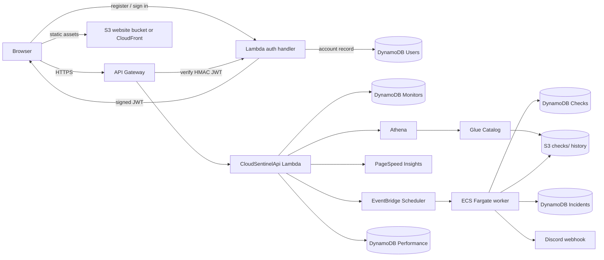
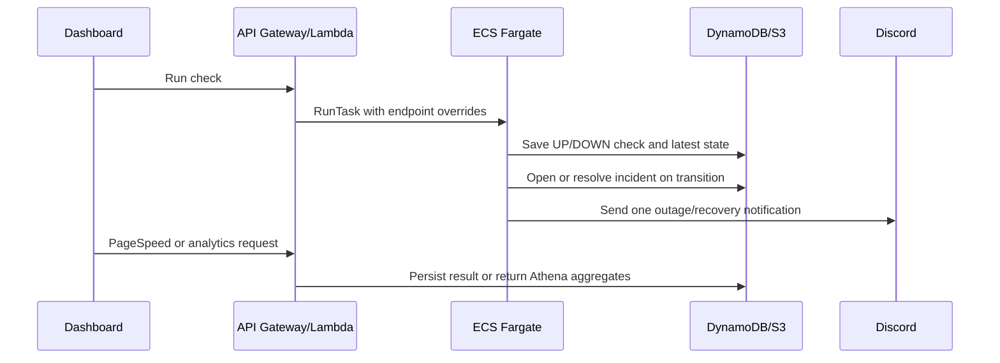

# CloudSentinel architecture

## Minimum viable product

The assessed MVP supports five user journeys:

1. Register, update, enable/disable, and delete a monitored HTTP endpoint.
2. Run an immediate availability check and view the result.
3. Configure recurring checks that run without manual AWS Console or CLI actions.
4. Detect outages/recoveries and send a webhook notification.
5. View historical uptime, incidents, latency, and PageSpeed performance.

Multi-team permissions, SMS/email channels, geographic probes, and public status pages are deferred until the assessed workflows are reliable. Basic account registration, login, and per-user monitor ownership are implemented.

## Deployed and deployable flows

### Assessment flow diagram



### State-transition evidence



### Interactive application

```text
Browser
  -> CloudFront when configured, otherwise S3 website endpoint
  -> S3 frontend assets
  -> DynamoDB account sign-in and short-lived JWT session
  -> API Gateway
  -> Lambda API functions
  -> DynamoDB
```

### Immediate and scheduled monitoring

```text
Dashboard "Run now" -> API Gateway -> Lambda -> ECS RunTask
EventBridge Scheduler ---------------------------> ECS RunTask
ECS Fargate worker -> monitored website/API
                   -> DynamoDB latest state and result
                   -> S3 historical result
                   -> owner-specific Discord webhook on state transition
```

### Historical analytics

```text
S3 partitioned results -> Glue Data Catalog -> Athena
Dashboard -> API Gateway -> Lambda -> Athena -> dashboard charts
```

### PageSpeed

```text
Dashboard -> API Gateway -> Lambda -> PageSpeed Insights API
                                    -> DynamoDB/S3 persisted result
```

## Service responsibilities

| Service | Responsibility | Automated invocation evidence |
|---|---|---|
| S3 | Frontend assets and partitioned historical result files | Frontend deployment and monitoring-worker writes |
| CloudFront | Securely deliver the React application when permitted by the Learner Lab | Browser requests use the CloudFront URL; otherwise the S3 website URL is used |
| API Gateway | Expose monitor, check, incident, performance, and analytics APIs | React operations send HTTPS requests |
| DynamoDB user records + Lambda auth | Store account credentials and issue signed JWT sessions | React register/sign-in flow; Lambda verifies the JWT |
| Lambda | Validate requests, manage records/schedules/tasks, and invoke analytics/external APIs | API Gateway invokes functions |
| DynamoDB | Store monitor configuration, latest state, results, incidents, and PageSpeed records | Lambda and ECS worker read/write data |
| ECR | Store the monitoring-worker image | Deployment publishes the versioned image |
| ECS Fargate | Execute isolated availability checks | Lambda and EventBridge Scheduler start tasks |
| EventBridge Scheduler | Run recurring monitor tasks | Schedules are created/updated by application code |
| Glue | Describe the historical S3 dataset | Deployment/crawler updates the catalog |
| Athena | Calculate historical uptime and latency analytics | Lambda starts queries for the dashboard |
| PageSpeed Insights | External performance audit | A dashboard operation invokes the API |
| Secrets Manager | Per-user Discord webhook credentials | API stores them; worker reads only the owner-specific secret |
| Notification webhook | External outage/recovery alert | The worker invokes the owner's webhook on incident transitions |

EventBridge Scheduler and ECR are important supporting services but should not be assumed to earn marks outside the categories listed in the assignment rubric.

## Domain model

### Monitor

| Field | Type | Purpose |
|---|---|---|
| `id` | UUID/string | Stable monitor identifier |
| `ownerId` | Application JWT `sub` | User ownership and tenant boundary |
| `name` | string | Human-readable label |
| `url` | HTTP/HTTPS URL | Destination to check |
| `intervalMinutes` | 5, 15, 30, or 60 | Recurring-check frequency |
| `enabled` | boolean | Whether a schedule should be active |
| `createdAt` / `updatedAt` | ISO timestamp | Audit and ordering fields |
| `latestCheck` | CheckResult, optional | Fast dashboard status display |

### CheckResult

Records monitor ID, timestamp, state (`UP`/`DOWN`), status code, response time, source (`MANUAL`/`SCHEDULED`), and a safe error summary.

### Incident

Records the monitor, open/closed status, start/recovery timestamps, triggering check, and notification timestamps.

### PerformanceResult

Records PageSpeed category scores and selected web-vital metrics for a monitor and timestamp.

## DynamoDB access design

The initial implementation uses separate tables because they are easier to explain and demonstrate within the assignment:

- `CloudSentinelMonitors`: monitor ID partition key plus `ownerId-createdAt-index` for user-scoped queries.
- `CloudSentinelChecks`: `endpointId` partition key and `checkedAt` sort key.
- `CloudSentinelIncidents`: `endpointId` partition key and `openedAt` sort key.
- `CloudSentinelPerformance`: `endpointId` partition key and `measuredAt` sort key.

A single-table design is not required for this workload and would add explanation and implementation risk without improving the assessed user journeys.

For the Learner Lab deployment, the application auth repository stores user records as `entityType=USER` items in `CloudSentinelMonitors`; this avoids requiring a new DynamoDB table permission. User records have a generated `user#...` ID, normalized email, scrypt password hash, and creation timestamp. Endpoint queries use the owner GSI, so these records are not returned as monitors.

## Local fallback and deployment boundaries

- Without `VITE_API_BASE_URL`, the web dashboard uses local mock data so the UI can be demonstrated without AWS credentials.
- With a real HTTPS API base URL, the dashboard invokes API Gateway, Lambda, DynamoDB, ECS, PageSpeed, and Athena routes.
- In AWS mode, the dashboard requires an application account before loading or changing AWS-backed monitors. The health and register/login routes remain public for deployment checks and account creation.
- The worker performs a real HTTP check when run with a target URL, while tests inject a fake fetch implementation.
- The CDK stack is the reproducible baseline for standard AWS accounts; Learner Lab deployments may continue to use the documented pre-created `LabRole` and manual resource settings where permissions require it.
- Existing pre-authentication lab monitors require a one-time owner migration to the application user's JWT `sub`; new records are owner-scoped automatically.
- No secrets, account identifiers, or AWS credentials belong in this repository.
